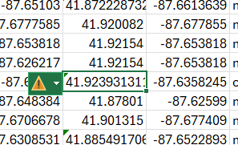
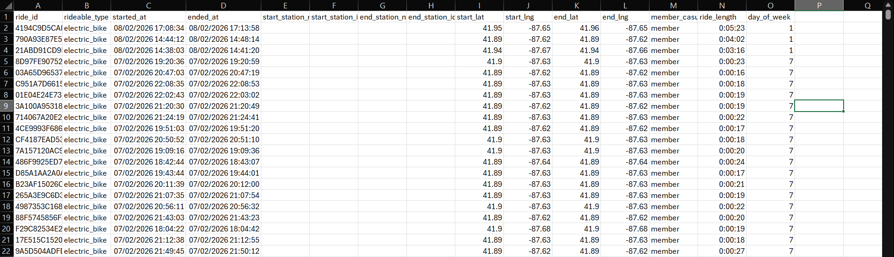
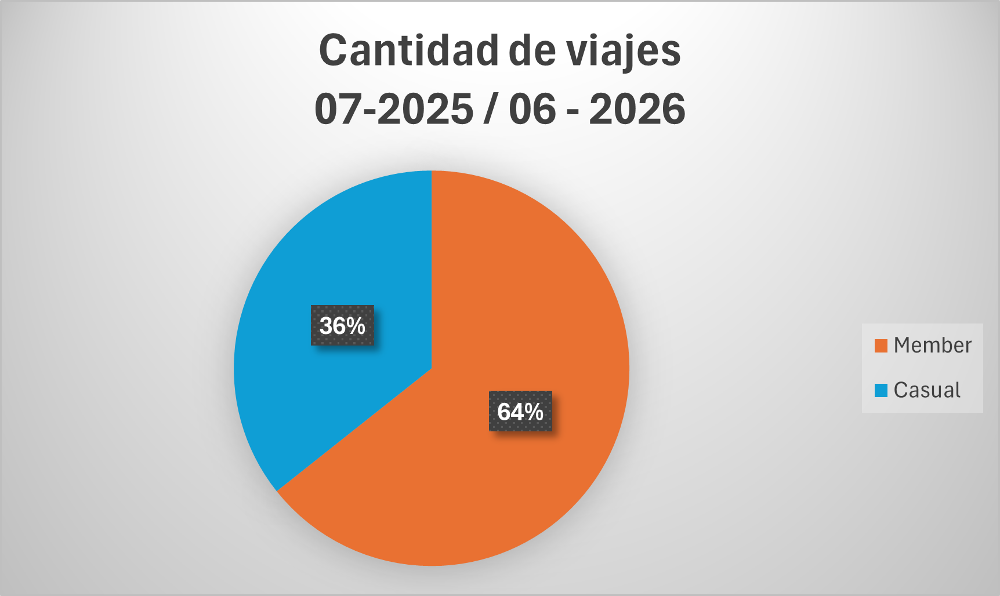
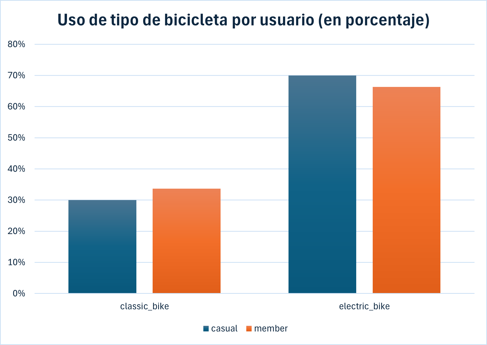
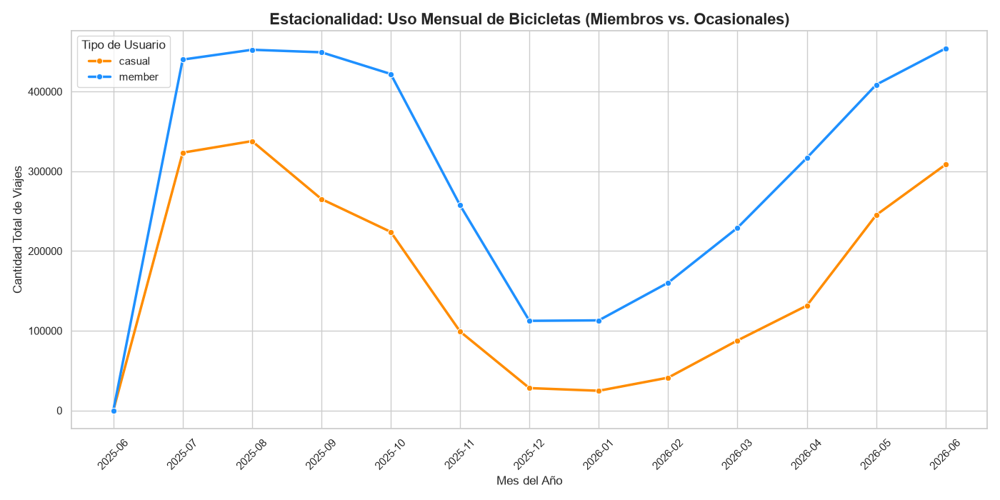

# 🚲 Caso de Estudio Cyclistic: ¿Cómo logramos que las bicicletas compartidas se usen más?

Este proyecto analiza los datos históricos de viajes de Cyclistic, una empresa de bicicletas compartidas en Chicago. El objetivo es proporcionar recomendaciones respaldadas por datos para convertir a los usuarios ocasionales en miembros anuales.

A continuación, detallo el proceso siguiendo las seis fases del análisis de datos.

---

## 1. ❓ Preguntar (Ask)
**Tarea Empresarial:** Analizar los datos de uso de Cyclistic para entender cómo difiere el comportamiento entre los miembros anuales y los usuarios casuales, con el fin de diseñar una nueva estrategia de marketing.

**Pregunta clave que guía el análisis:**
* ¿En qué se diferencian los socios anuales y los ciclistas ocasionales con respecto al uso de las bicicletas de Cyclistic?

## 2. 🗂️ Preparar (Prepare)
Los datos utilizados son registros históricos (12 meses) proporcionados por Motivate International Inc. bajo licencia. 

*   **Privacidad:** Los datos están anonimizados; no se utiliza información personal de los usuarios.
*   **Organización:** Los datos originales constan de millones de registros estructurados en archivos CSV mensuales, los cuales se encuentran referenciados en el directorio `data/` de este repositorio.

Los datos corresponden a Julio de 2025 a Junio de 2026.

## 3. 🧹 Procesar (Process)
Dado el gran volumen de datos (más de 5 millones de registros), utilicé **Python (Pandas)** para el procesamiento y limpieza, complementado con **Excel** para exploraciones iniciales y comprensión de los datos.

El código detallado se encuentra en `scripts/limpieza.py` y en el notebook `notebook/caso-ciclystic.ipynb`. Las acciones clave incluyeron:
*   Eliminación de valores nulos (NA) que afectaban variables críticas como la estación de inicio y fin.
*   Filtrado de viajes con duraciones negativas o aquellos asociados a pruebas de mantenimiento en las estaciones.
*   Creación de nuevas columnas calculadas: `ride_length` (duración del viaje en minutos) y `day_of_week` (día de la semana).

## 4. 📈 Analizar (Analyze)
Con los datos limpios, ejecuté agregaciones para descubrir tendencias (ver `scripts/analisisV2.py`). 

Algunas métricas clave calculadas:
*   Promedio, máximo y moda de la duración de los viajes, agrupados por tipo de usuario.
*   Volumen total de viajes por día de la semana para usuarios casuales vs. miembros anuales.
*   Preferencia de tipo de bicicleta (clásica, eléctrica).

## 5. 📊 Compartir (Share)
Las visualizaciones principales fueron creadas en **Excel** a partir de los datos obtenidos mediante el script de análisis para identificar patrones visualmente.

### Proporción Total de Viajes (Julio 2025 - Junio 2026)
> **Insight:** Al analizar el volumen total de viajes durante este año de operación, se observo que los miembros anuales ("Member") representan la clara mayoría con un 64% del total. Los usuarios casuales ("Casual") constituyen el 36% restante. Esto indica que, si bien la adopción del modelo de membresía ya es fuerte, existe un mercado objetivo de más de una tercera parte de los viajes totales que tiene el potencial de convertirse en miembros regulares.

### Demanda por Día de la Semana
> **Insight:** Los miembros anuales utilizan el servicio de manera constante entre semana (sugiriendo viajes de ida y vuelta al trabajo), mientras que los usuarios casuales tienen picos significativos los fines de semana.

### Duración Promedio del Viaje
> **Insight:** Los usuarios casuales realizan viajes de mucha mayor duración promedio en comparación con los miembros anuales, indicando un uso más recreativo.

### Preferencia de Tipo de Bicicleta por Usuario
> **Insight:** Al analizar el tipo de bicicleta elegida, descubrimos que ambos grupos muestran una fuerte y clara preferencia por las bicicletas eléctricas (`electric_bike`) sobre las clásicas (`classic_bike`). Curiosamente, los usuarios casuales tienen una inclinación ligeramente mayor hacia las opciones eléctricas (representando casi el 70% de sus viajes) en comparación con los miembros anuales. 
> 
> *Implicación de negocio:* Dado este alto interés, cualquier nueva estrategia de marketing o tipo de membresía diseñada para atraer a los usuarios casuales debería destacar los beneficios exclusivos relacionados con el uso de bicicletas eléctricas (por ejemplo, tarifas preferenciales por minuto o desbloqueos gratuitos).

### Estacionalidad y Tendencia Mensual (Julio 2025 - Junio 2026)
> **Insight:** El comportamiento de uso a lo largo del año muestra una fuerte y marcada estacionalidad que afecta a ambos grupos de manera casi idéntica. Los meses de verano y principios de otoño (julio a septiembre de 2025) representan el pico máximo de demanda, mientras que los meses de invierno (diciembre de 2025 a febrero de 2026) muestran una caída drástica en el uso del servicio. A pesar de esta fluctuación, los miembros anuales mantienen consistentemente un volumen de viajes superior al de los usuarios casuales en todos los meses del año.
> 
> *Implicación de negocio:* Las campañas de marketing orientadas a la conversión de membresías no deben lanzarse en invierno. El momento ideal para una campaña agresiva es durante la primavera (abril - mayo), justo cuando la tendencia de uso de los usuarios casuales comienza a dispararse de nuevo para la temporada alta.

## 6. 💡 Actuar (Act): Recomendaciones Estratégicas

Basado en los hallazgos del análisis, propongo tres estrategias accionables para maximizar la conversión de usuarios casuales a miembros anuales:

1. **Campañas de conversión de fin de semana (Hiperdirigidas)**
   * **El dato:** El volumen de usuarios casuales se dispara los fines de semana (alcanzando más de 440,000 viajes solo en sábados), a diferencia del uso lineal de los miembros entre semana.
   * **La acción:** Diseñar anuncios en redes sociales y notificaciones *in-app* que se activen específicamente los viernes por la tarde. El mensaje debe promocionar la conveniencia y rentabilidad de la membresía anual para planes de ocio y recreación.

2. **Incentivos basados en E-Bikes y ahorro por duración**
   * **El dato:** Los casuales realizan viajes casi el doble de largos (21.7 min promedio vs. 12.4 min) y el 70% prefiere las bicicletas eléctricas.
   * **La acción:** Enviar campañas de email marketing personalizadas a los casuales recurrentes comparando lo que gastaron en sus viajes largos frente a lo que habrían pagado como miembros. Se sugiere incluir un gancho comercial como *"Sin tarifa de desbloqueo en E-bikes"* al adquirir la membresía anual.

3. **Sincronización estacional del presupuesto de marketing**
   * **El dato:** Existe una caída drástica del servicio en invierno (diciembre - febrero), seguida de un repunte masivo que culmina en los picos máximos de junio y julio.
   * **La acción:** En lugar de mantener un gasto publicitario constante, la empresa debe reservar la mayor parte de su presupuesto de conversión para lanzarlo agresivamente entre abril y mayo. Esto interceptará a los usuarios justo cuando su intención natural de uso comienza a subir de cara al verano.
---
## 🔗 Enlaces del Proyecto

*   **Notebook Interactivo (Ejecutable):** [Explora y corre el código directamente en Kaggle](https://www.kaggle.com/code/abnerruiz/caso-ciclystic)

*Revisar el código fuente completo en la carpeta [notebook](notebook/) y [scripts](scripts/) de este repositorio.*
*Revisar el pdf dentro de la carpeta [docs](docs/), ya que ahi estan las conclusiones obtenidas plasmadas en una presentación para compartir con las partes interesadas*
