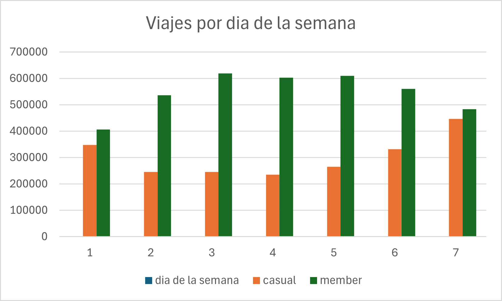
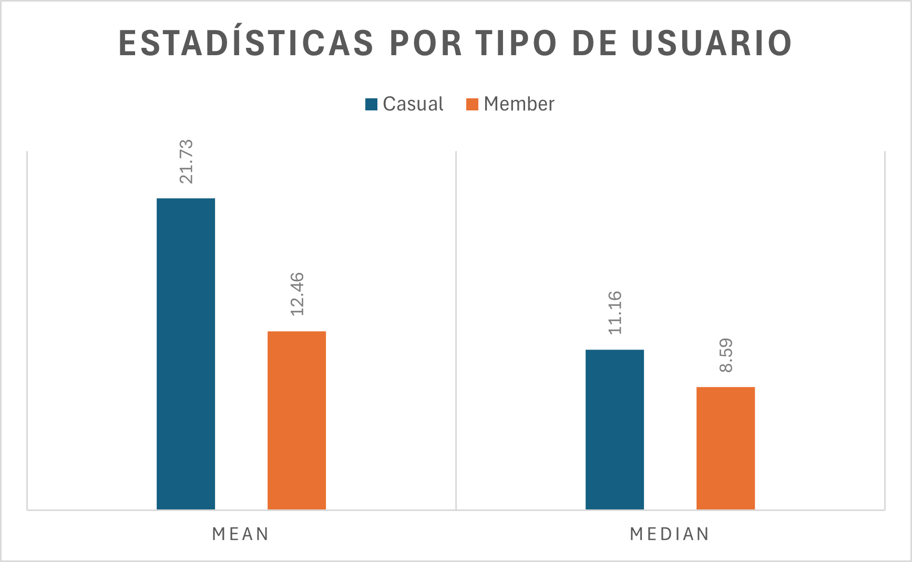

# 🚲 Caso de Estudio Cyclistic: ¿Cómo logramos que las bicicletas compartidas se usen más?

Este proyecto analiza los datos históricos de viajes de Cyclistic, una empresa de bicicletas compartidas en Chicago. El objetivo es proporcionar recomendaciones respaldadas por datos para convertir a los usuarios ocasionales en miembros anuales.

A continuación, detallo el proceso siguiendo las seis fases del análisis de datos.

---

## 1. ❓ Preguntar (Ask)
**Tarea Empresarial:** Analizar los datos de uso de Cyclistic para entender cómo difiere el comportamiento entre los miembros anuales y los usuarios casuales, con el fin de diseñar una nueva estrategia de marketing.

**Pregunta clave que guía el análisis:**
* ¿En qué se diferencian los socios anuales y los ciclistas ocasionales con respecto al uso de las bicicletas de Cyclistic?

## 2. 🗂️ Preparar (Prepare)
Los datos utilizados son registros históricos (12 meses) proporcionados por Motivate International Inc. bajo licencia. 

*   **Privacidad:** Los datos están anonimizados; no se utiliza información personal de los usuarios.
*   **Organización:** Los datos originales constan de millones de registros estructurados en archivos CSV mensuales, los cuales se encuentran referenciados en el directorio `data/` de este repositorio.

## 3. 🧹 Procesar (Process)
Dado el gran volumen de datos (más de 5 millones de registros), utilicé **Python (Pandas)** para el procesamiento y limpieza, complementado con **Excel** para exploraciones iniciales y comprensión de los datos.

El código detallado se encuentra en `scripts/limpieza.py` y en el notebook `notebook/caso-ciclystic.ipynb`. Las acciones clave incluyeron:
*   Eliminación de valores nulos (NA) que afectaban variables críticas como la estación de inicio y fin.
*   Filtrado de viajes con duraciones negativas o aquellos asociados a pruebas de mantenimiento en las estaciones.
*   Creación de nuevas columnas calculadas: `ride_length` (duración del viaje en minutos) y `day_of_week` (día de la semana).

## 4. 📈 Analizar (Analyze)
Con los datos limpios, ejecuté agregaciones para descubrir tendencias (ver `scripts/analisisV2.py`). 

Algunas métricas clave calculadas:
*   Promedio, máximo y moda de la duración de los viajes, agrupados por tipo de usuario.
*   Volumen total de viajes por día de la semana para usuarios casuales vs. miembros anuales.
*   Preferencia de tipo de bicicleta (clásica, eléctrica).

## 5. 📊 Compartir (Share)
Las visualizaciones principales fueron creadas en **Excel** a partir de los datos obtenidos mediante el script de análisis para identificar patrones visualmente. 

### Demanda por Día de la Semana
> **Insight:** Los miembros anuales utilizan el servicio de manera constante entre semana (sugiriendo viajes de ida y vuelta al trabajo), mientras que los usuarios casuales tienen picos significativos los fines de semana.

### Duración Promedio del Viaje
> **Insight:** Los usuarios casuales realizan viajes de mucha mayor duración promedio en comparación con los miembros anuales, indicando un uso más recreativo.

## 6. 💡 Actuar (Act)
Basado en los hallazgos, mis tres recomendaciones principales para la estrategia de marketing son:

1.  **Campañas de Fin de Semana:** Lanzar promociones específicas los viernes por la tarde y fines de semana dirigidas a usuarios casuales en las estaciones más populares cerca de zonas recreativas.
2.  **Incentivos por Duración:** Crear una membresía anual o "pase de temporada" que ofrezca beneficios adicionales para viajes largos, apelando al comportamiento del usuario casual.
3.  **Mensajes Estacionales:** Aprovechar los picos de uso en primavera y verano para lanzar campañas agresivas de conversión en la aplicación móvil y estaciones físicas.

---
*Revisar el código fuente completo en la carpeta [notebook](notebook/) y [scripts](scripts/) de este repositorio.*